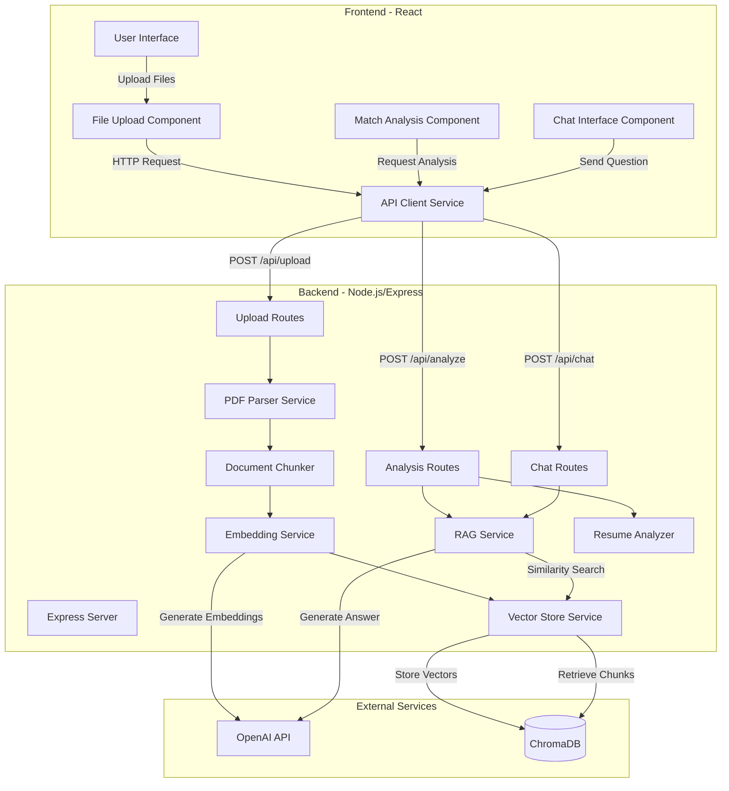
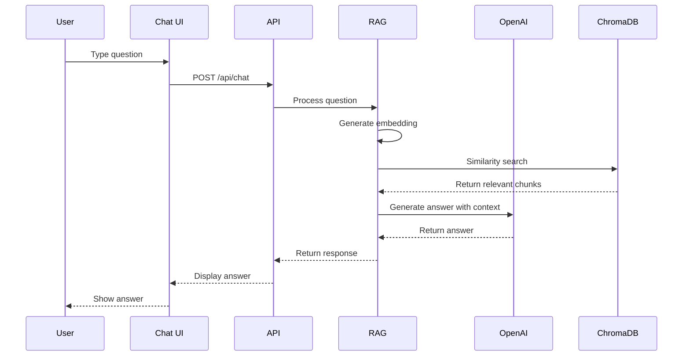
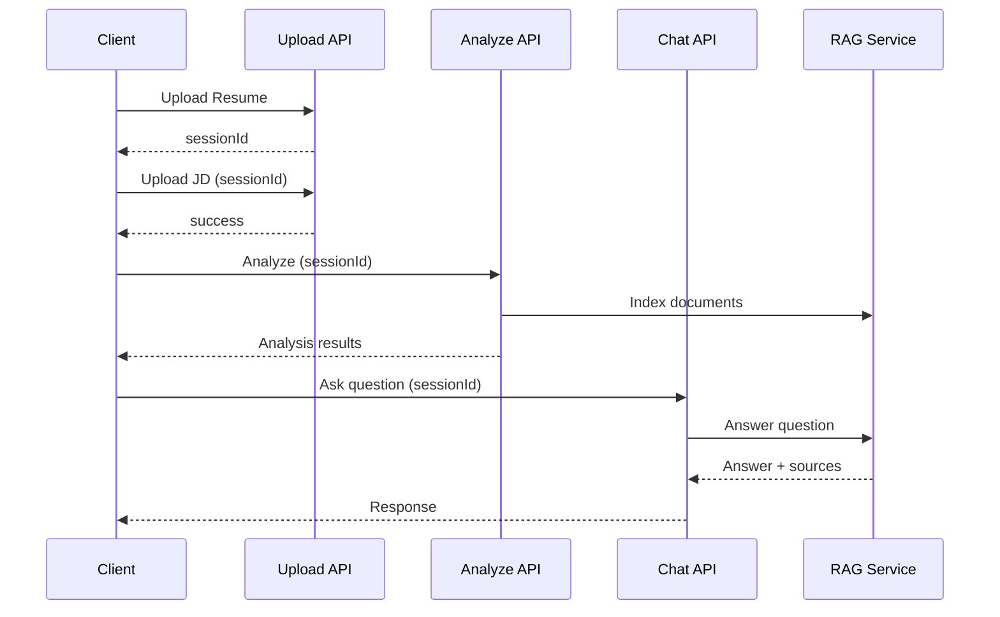

# 🏗️ Architecture Documentation

## System Overview

The Resume Screening Tool is a full-stack web application that leverages RAG (Retrieval-Augmented Generation) technology to provide intelligent resume analysis and question-answering capabilities.



## Component Architecture

### Frontend Components

#### 1. FileUpload Component

**Purpose**: Handle resume and job description file uploads

**Features**:

- Drag-and-drop support
- File type validation (PDF, TXT)
- Upload progress feedback
- State management for uploaded files

**State Flow**:

```
User selects file → Validate file type → Upload to backend → Update session state
```

#### 2. MatchAnalysis Component

**Purpose**: Display resume match results

**Features**:

- Circular progress indicator for match score
- Strengths list with visual indicators
- Gaps list highlighting missing qualifications
- Key insights display
- Resume highlights (skills, experience, education)

**Data Structure**:

```typescript
{
  matchScore: number,
  strengths: string[],
  gaps: string[],
  insights: string[],
  resumeHighlights: {
    skills: string[],
    experience: string,
    education: string
  }
}
```

#### 3. ChatInterface Component

**Purpose**: RAG-powered Q&A interface

**Features**:

- Message thread display
- Typing indicators
- Suggested questions
- Auto-scroll to latest message
- Input validation

**Message Flow**:



### Backend Services

#### 1. PDF Parser Service

**File**: `src/services/pdfParser.ts`

**Responsibilities**:

- Extract text from PDF files using pdf-parse
- Handle TXT file reading
- Clean and normalize extracted text

**Methods**:

- `parsePDF(filePath)` → Extract text from PDF
- `parseTXT(filePath)` → Read text file
- `parseFile(filePath)` → Auto-detect and parse
- `cleanText(text)` → Normalize text

#### 2. Document Chunker Service

**File**: `src/services/documentChunker.ts`

**Responsibilities**:

- Split documents into logical sections
- Identify resume sections (Skills, Experience, Education)
- Identify JD sections (Requirements, Responsibilities)

**Chunking Strategy**:

```
Resume → [Skills Section, Experience Section, Education Section, Summary Section]
JD → [Requirements Section, Responsibilities Section, Qualifications Section]
```

**Section Detection**:

- Uses pattern matching on section headers
- Fall-through to "other" section for unmatched content
- Preserves section metadata for retrieval

#### 3. Embedding Service

**File**: `src/services/embeddingService.ts`

**Responsibilities**:

- Generate vector embeddings using OpenAI
- Batch processing for efficiency
- Rate limiting handling

**Model**: `text-embedding-3-small` (1536 dimensions)

**Batch Processing**:

- Process up to 20 texts per batch
- Prevents rate limiting
- Optimizes API usage

#### 4. Vector Store Service

**File**: `src/services/vectorStore.ts`

**Responsibilities**:

- Manage ChromaDB collections (one per session)
- Store embeddings with metadata
- Perform similarity searches
- Collection lifecycle management

**Data Model**:

```typescript
{
  id: string,              // Unique chunk ID
  embedding: number[],     // 1536-dim vector
  document: string,        // Chunk text
  metadata: {
    section: string,       // Section name
    position: number,      // Chunk position
    documentType: string   // 'resume' or 'job_description'
  }
}
```

#### 5. RAG Service

**File**: `src/services/ragService.ts`

**Responsibilities**:

- Core RAG pipeline implementation
- Document indexing (chunking → embedding → storage)
- Question answering (embedding → retrieval → generation)

**RAG Pipeline**:

```
1. Document Indexing:
   Document → Chunks → Embeddings → Vector DB

2. Question Answering:
   Question → Embedding → Similarity Search → Retrieve Top-K Chunks
   → Build Context → LLM Prompt → Generate Answer
```

**Context Building**:

```typescript
const context = relevantChunks
  .map(chunk => `[${chunk.metadata.section}]\n${chunk.content}`)
  .join('\n\n---\n\n');
```

**LLM Prompt Template**:

```
System: You are an AI assistant helping recruiters evaluate candidates.
Answer based ONLY on the provided context from the resume.

Context: {retrieved_chunks}

Question: {user_question}
```

#### 6. Resume Analyzer Service

**File**: `src/services/resumeAnalyzer.ts`

**Responsibilities**:

- Extract structured data from resumes
- Parse job description requirements
- Calculate match scores
- Identify strengths and gaps

**Match Score Algorithm**:

```
Total Score = (Skills Match × 0.4) 
            + (Experience Match × 0.3)
            + (Education Match × 0.2)
            + (Additional Factors × 0.1)

Skills Match:
- Count matched required skills
- Score = matched / total_required

Experience Match:
- Compare years of experience
- 100% if meets requirement
- 70% if 70%+ of required experience
- 40% otherwise

Education Match:
- 100% if has Bachelor's or higher
- 50% otherwise
```

## API Architecture

### Session Management

Each upload creates or updates a session:

```typescript
Session {
  id: string,
  resumeText?: string,
  jobDescriptionText?: string,
  resumeData?: ResumeData,
  jobDescriptionData?: JobDescriptionData,
  analysis?: AnalysisResult,
  chatHistory: ChatMessage[],
  createdAt: Date
}
```

### Request/Response Flow



## Data Flow

### 1. Document Upload & Processing

```
User uploads file
    ↓
Multer stores file temporarily
    ↓
PDF Parser extracts text
    ↓
Text is cleaned and normalized
    ↓
Session is created/updated
    ↓
Response with sessionId
```

### 2. Analysis Flow

```
Client requests analysis
    ↓
Extract structured data from resume
    ↓
Extract structured data from JD
    ↓
Calculate match score (weighted algorithm)
    ↓
Identify strengths and gaps
    ↓
[Background] Index documents for RAG
    ↓
Return analysis results
```

### 3. RAG Question Answering Flow

```
User asks question
    ↓
Store user message in chat history
    ↓
Generate question embedding
    ↓
Similarity search in vector DB
    ↓
Retrieve top 5 relevant chunks
    ↓
Build context from chunks
    ↓
Send to GPT with conversation history
    ↓
Generate answer grounded in context
    ↓
Store assistant response
    ↓
Return answer with source citations
```

## Security Considerations

- **File Upload**: Size limits (10MB), type validation
- **CORS**: Configured to accept requests from frontend origin only
- **API Keys**: Stored in environment variables, never exposed to frontend
- **Session Isolation**: Each session has its own vector collection
- **Input Validation**: All API endpoints validate required parameters

## Performance Optimizations

- **Batch Embedding**: Process multiple chunks in single API call
- **Async Indexing**: RAG indexing runs in background after analysis
- **In-Memory Vector DB**: Fast similarity searches with ChromaDB
- **Efficient Chunking**: Section-based chunking reduces chunk count
- **Top-K Retrieval**: Only retrieve top 5 most relevant chunks

## Scalability Considerations

**Current Design** (Demo/Development):

- In-memory session storage
- In-memory vector database (ChromaDB)
- Single server instance

**Production Recommendations**:

- Use PostgreSQL/MongoDB for session persistence
- Use Pinecone/Qdrant for production vector storage
- Implement Redis for caching
- Use message queue for async processing
- Deploy with load balancer and multiple instances
- Implement rate limiting per user
- Add authentication/authorization

## Technology Choices

| Component   | Technology                    | Reasoning                                           |
| ----------- | ----------------------------- | --------------------------------------------------- |
| Backend     | Node.js + TypeScript          | Type safety, async I/O, npm ecosystem               |
| Frontend    | React + TypeScript            | Component reusability, type safety, large community |
| Vector DB   | ChromaDB                      | Easy local setup, good for demo, Python/JS support  |
| Embeddings  | OpenAI text-embedding-3-small | Cost-effective, high quality, fast                  |
| LLM         | GPT-4o-mini                   | Better quality, cost-effective, fast                |
| Build Tool  | Vite                          | Fast HMR, modern build tooling                      |
| HTTP Client | Axios                         | Promise-based, interceptors, TypeScript support     |

## Error Handling

### Backend

- Try-catch blocks in all async operations
- Dedicated error handling middleware
- Typed error responses
- Logging to console (would use proper logging service in production)

### Frontend

- API error catching and user-friendly messages
- Loading states prevent multiple submissions
- Form validation before API calls
- Error state display in UI

## Future Enhancements

1. **Authentication**: User accounts and saved sessions
2. **Batch Processing**: Analyze multiple resumes at once
3. **Custom Scoring**: Allow recruiters to adjust weights
4. **Resume Parsing**: Better extraction of structured data
5. **Export Features**: PDF reports, CSV exports
6. **Analytics**: Track screening metrics
7. **Multi-language**: Support non-English resumes
8. **Advanced RAG**: Implement re-ranking, hybrid search
